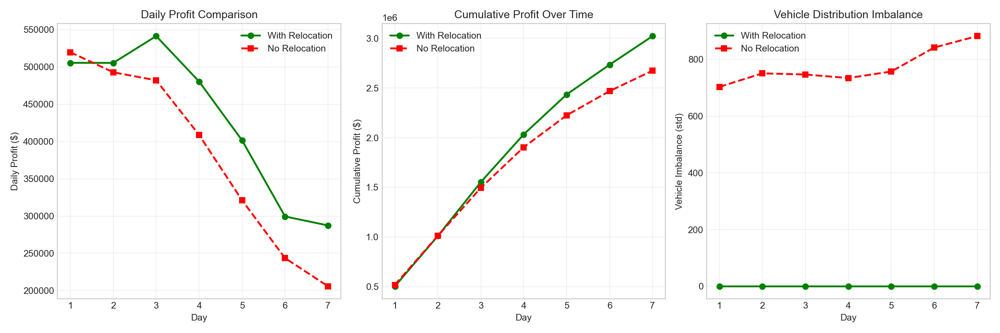

# EV-Sharing System Optimization

[](https://opensource.org/licenses/MIT)
[](https://www.python.org/downloads/)

## Breaking the Operational Trilemma: A Bilevel Integrated Framework for Electric Vehicle Sharing Systems

### 📖 Overview

This repository contains the implementation for **joint optimization of dynamic pricing, smart charging, and vehicle relocation** in one-way electric vehicle (EV) sharing systems.

We address the "Operational Trilemma" faced by EV-sharing operators: balancing conflicting objectives of demand management, energy cost minimization, and spatiotemporal fleet balancing.

### 🔬 Key Contributions

1. **Bilevel-Derived Integrated Modeling (MIQP)**: Mixed-Integer Quadratic Programming formulation jointly optimizing pricing, charging, and relocation with power grid constraints via KKT conditions.

2. **Scalable Algorithm (LBBD)**: Logic-Based Benders Decomposition reducing computation time by **89%** compared to monolithic solvers with only 1.2% optimality gap.

3. **Stochastic Control (ADP)**: Approximate Dynamic Programming with post-decision states achieving **+5.64%** profit improvement under demand uncertainty.

4. **High-Fidelity Validation (DES)**: Discrete-Event Simulation framework with non-homogeneous Poisson arrivals.

### 📊 Key Results

| Metric | Result |
|--------|--------|
| Weekly Profit Improvement | **+13.0%** |
| LBBD Speedup | **9.6x faster** |
| ADP Policy Gain | **+5.64%** |
| LBBD Optimality Gap | **1.2%** |

---

## 🏗️ Project Structure

```
EV-sharing/
├── README.md                      # Project overview
├── LICENSE                        # MIT License
├── requirements.txt               # Python dependencies
├── .gitignore                     # Git ignore rules
│
├── src/                           # Source code
│   ├── algorithms/                # Optimization algorithms
│   │   ├── miqp_optimizer.py      # Algorithm 1: MIQP pricing/charging
│   │   ├── lbbd_relocation.py     # Algorithm 2: LBBD relocation
│   │   ├── adp_controller.py      # Algorithm 3: ADP stochastic control
│   │   └── des_simulator.py       # Algorithm 4: Discrete-Event Simulation
│   │
│   ├── models/                    # System models
│   │   ├── power_grid.py          # IEEE 33-bus grid model
│   │   ├── ev_fleet.py            # EV fleet model
│   │   └── simulation.py          # Simulation model
│   │
│   ├── utils/                     # Utilities
│   │   ├── config.py              # Configuration parameters
│   │   ├── data_loader.py         # Data loading
│   │   └── visualization.py       # Plotting utilities
│   │
│   └── experiments/               # Experiment runners
│       ├── run_main_experiment.py
│       ├── run_adp_experiment.py
│       ├── run_baseline_comparison.py
│       └── run_multiday_simulation.py
│
├── data/                          # Data files
│   ├── raw/                       # Raw data (download separately)
│   ├── processed/                 # Processed OD matrices
│   └── grid/                      # Power grid data (IEEE 33-bus)
│
├── results/                       # Experiment results
│   ├── figures/                   # Result figures
│   └── logs/                      # Experiment logs
│
└── scripts/                       # Utility scripts
    ├── preprocess_nyc_taxi.py     # Data preprocessing
    ├── download_data.py           # Data download
    └── generate_plots.py          # Generate figures
```

---

## 🚀 Getting Started

### Prerequisites

- Python 3.8+
- [Gurobi Optimizer](https://www.gurobi.com/) (with valid license)

### Installation

```bash
# Clone repository
git clone https://github.com/yourusername/EV-sharing.git
cd EV-sharing

# Create virtual environment
python -m venv .venv
source .venv/bin/activate  # macOS/Linux
# .venv\Scripts\activate   # Windows

# Install dependencies
pip install -r requirements.txt
```

### Data Preparation

Download and preprocess NYC Taxi data:

```bash
python scripts/preprocess_nyc_taxi.py
```

---

## 💻 Usage

### Run Main Experiment

```bash
python src/experiments/run_main_experiment.py
```

### Run Individual Components

```bash
# ADP Training & Evaluation
python src/experiments/run_adp_experiment.py

# Baseline Comparison
python src/experiments/run_baseline_comparison.py

# Multi-day Simulation
python src/experiments/run_multiday_simulation.py
```

### Generate Plots

```bash
python scripts/generate_plots.py
```

---

## 📈 Results

### Multi-Day Performance Comparison



### Pareto Frontier (Profit vs. Service Rate)


---

## 🔧 Configuration

Modify parameters in `src/utils/config.py`:

```python
class Config:
    num_stations = 10           # Operational zones
    num_hours = 24              # Time periods/day
    vehicles_per_station = 800  # Fleet size/zone
    E_max = 70.0                # Battery capacity (kWh)
    charging_rate = 7.0         # Level-2 AC (kW)
    price_elasticity = 5.0      # Demand elasticity
    relocation_cost = 5.0       # Relocation cost ($)
```

---

## 📚 Citation

```bibtex
@article{pang2025evsharing,
  title={Breaking the Operational Trilemma: A Bilevel Integrated Framework 
         for Electric Vehicle Sharing Systems via Logic-Based Benders Decomposition},
  author={Pang, Yuting and Sun, Yuze and Xu, Feifei and Pu, Bingsheng},
  journal={arXiv preprint},
  year={2025}
}
```

---

## 📝 License

MIT License - see [LICENSE](LICENSE) for details.

## 👥 Authors

- **Pang Yuting** - Tsinghua University
- **Sun Yuze** - Tsinghua University
- **Xu Feifei** - Tsinghua University
- **Pu Bingsheng** - Tsinghua University

---

<p align="center">⚡ Star this repository if you find it useful! ⚡</p>
